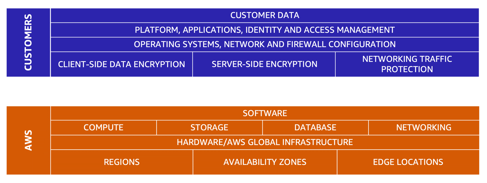
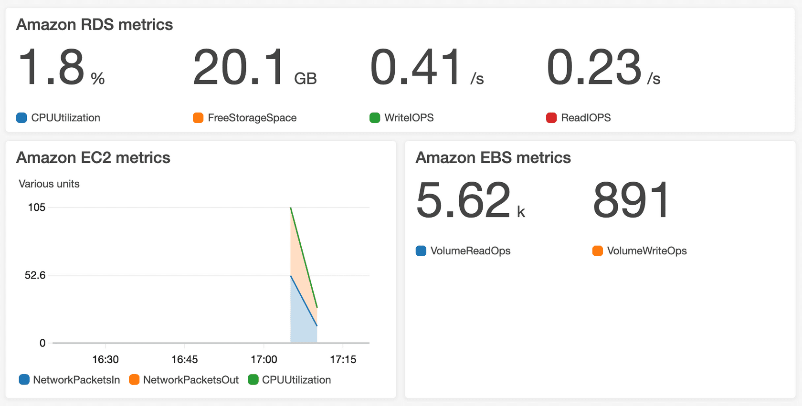

# AWS Cloud Practitioner Notes

## Cloud Computing
- **What is Cloud Computing**
  - Cloud Computing is the on-demand delivery of IT resources, particularly compute power, application hosting, database, networking, and more.
  - Works on a Client-Server model of computing.
  - Pay only for what you request or use (pay-as-you-go model).
  - Access your requested resources in seconds or minutes, but sometimes instantly.
- **Deployment models for cloud computing**
  - When selecting a cloud strategy, a company must consider factors such as required cloud application components, preferred resource management tools, and any legacy IT infrastructure requirements.
  - Here are the three cloud computing deployment models:
    - Cloud-Based Deployment
      - Run all parts of the application in the cloud.
      - Migrate existing applications to the cloud.
      - Design and build new applications in the cloud.
    - On-Premises Deployment
      - Deploy resources by using virtualization and resource management tools.
      - Increase resource utilization by using application management and virtualization technologies.
    - Hybrid Deployment
      - Connect cloud-based resources to on-premises infrastructure.
      - Integrate cloud-based resources with legacy IT applications.
- **Benefits of cloud computing**
  - Trade upfront expense for variable expense
  - Stop spending money to run and maintain data centers
  - Stop guessing capacity
  - Benefit from massive economies of scale (Benefit from customers aggregated usage, with prices drops per unit used)
  - Increase speed and agility
  - Go global in minutes (AWS global infrastructure available at 31 locations globally)

## Computing in the cloud
- **Amazon Elastic Compute Cloud (Amazon EC2)**
  - Amazon Elastic Compute Cloud (Amazon EC2) provides secure, resizable compute capacity in the cloud as Amazon EC2 instances.
  - You can provision and launch an Amazon EC2 instance within minutes.
  - You can stop using it when you have finished running a workload.
  - You pay only for the compute time you use when an instance is running, not when it is stopped or terminated.
  - You can save costs by paying only for server capacity that you need or want.
  - **Amazon EC2 instance types**
    - General purpose instances
      - provide a good balance of compute, memory, and networking resources.
      - You can use them for a variety of workloads, such as:
        - application servers
        - gaming servers
        - backend servers for enterprise applications
        - small and medium databases
    - Compute optimized instances
      - Ideal for compute-heavy applications that benefit from high-performance processors.
      - Ideal for high-performance web servers, compute-intensive applications servers, and dedicated gaming servers.
      - You can also use compute optimized instances for batch processing workloads that require processing many transactions in a single group.
    - Memory optimized instances
      - Designed to deliver fast performance for workloads that process large datasets in memory.
      - Ideal for scenarios like a high-performance database or a workload that involves performing real-time processing of a large amount of unstructured data.
    - Storage optimized instances
      - Designed for workloads that require high, sequential read and write access to large datasets on local storage.
      - Examples of workloads suitable for storage optimized instances include distributed file systems, data warehousing applications, and high-frequency online transaction processing (OLTP) systems.
    - Accelerated computing instances
      - Use hardware accelerators, or coprocessors, to perform some functions more efficiently than is possible in software running on CPUs.
      - Examples of these functions include floating-point number calculations, graphics processing, game streaming and data pattern matching.
  - **Amazon EC2 Pricing**
    - On-Demand
    - Amazon EC2 Savings Plans
    - Reserved Instances
    - Spot Instances
    - Dedicated Hosts
  - **Amazon EC2 Auto Scaling**
    - Amazon EC2 Auto Scaling enables you to automatically add or remove Amazon EC2 instances in response to changing application demand.
    - Within Amazon EC2 Auto Scaling, you can use two approaches:
      - Dynamic scaling: responds to changing demand.
      - Predictive scaling: automatically schedules the right number of Amazon EC2 instances based on predicted demand.

- **Elastic Load Balancing**
  - Elastic Load Balancing is the AWS service that automatically distributes incoming application traffic across multiple resources, such as Amazon EC2 instances.
  - A load balancer acts as a single point of contact for all incoming web traffic to your Auto Scaling group.
  - This means that as you add or remove Amazon EC2 instances in response to the amount of incoming traffic, these requests route to the load balancer first.
  - Then, the requests spread across multiple resources that will handle them.
  - Although Elastic Load Balancing and Amazon EC2 Auto Scaling are separate services, they work together to help ensure that applications running in Amazon EC2 can provide high performance and availability.
    - Here is an image that demonstrates the Elastic Load Balancing <br/>
      

- **Messaging and queuing** 
  - **Amazon Simple Notification Service (Amazon SNS)**
    - Amazon SNS is a publish/subscribe service. Using Amazon SNS topics, a publisher publishes messages to subscribers.
    - In Amazon SNS, subscribers can be web servers, email addresses, AWS Lambda functions, or several other options.
  - **Amazon Simple Queue Service (Amazon SQS)**
    - Amazon SQS is a message queuing service.
    - Using Amazon SQS, you can send, store, and receive messages between software components, without losing messages or requiring other services to be available.
    - In Amazon SQS, an application sends messages into a queue. A user or service retrieves a message from the queue, processes it, and then deletes it from the queue.

- **AWS Lambda**
  - AWS Lambda is a service that lets you run code without needing to provision or manage servers.
  - While using AWS Lambda, you pay only for the compute time that you consume.
  - Charges apply only when your code is running.
  - You can also run code for virtually any type of application or backend service, all with zero administration.
  - For example, a simple Lambda function might involve automatically resizing uploaded images to the AWS Cloud. In this case, the function triggers when uploading a new image.
  - How AWS Lambda works
    1. You upload your code to Lambda.
    2. You set your code to trigger from an event source, such as AWS services, mobile applications, or HTTP endpoints.
    3. Lambda runs your code only when triggered.
    4. You pay only for the compute time that you use.

- **Amazon Elastic Container Service (Amazon ECS)**
  - Amazon ECS is a highly scalable, high-performance container management system that enables you to run and scale containerized applications on AWS.
  - Amazon ECS supports Docker containers.
  - AWS supports the use of open-source Docker Community Edition and subscription-based Docker Enterprise Edition.
  - With Amazon ECS, you can use API calls to launch and stop Docker-enabled applications.
  - ECS is proprietary to AWS so migrating to another cloud provider can be difficult.

- **Amazon Elastic Kubernetes Service (Amazon EKS)**
  - Amazon EKS is a fully managed service that you can use to run Kubernetes on AWS.
  - Kubernetes is open-source software that enables you to deploy and manage containerized applications at scale.
  - A large community of volunteers maintains Kubernetes, and AWS actively works together with the Kubernetes community.
  - As new features and functionalities release for Kubernetes applications, you can easily apply these updates to your applications managed by Amazon EKS.
  - EKS runs & scales control-plane across multiple Availability Zones.
  - EKS scales control-plane instances based on load.
  - EKS can integrate with other AWS services.

- **AWS Fargate**
  - AWS Fargate is a serverless compute engine for containers. It works with both Amazon ECS and Amazon EKS.
  - When using AWS Fargate, you do not need to provision or manage servers.
  - AWS Fargate manages your server infrastructure for you.
  - You can focus more on innovating and developing your applications, and you pay only for the resources that are required to run your containers.

## AWS global infrastructure
- **AWS Region**
  - When determining the right Region for your services, data, and applications, consider the following four business factors:
    - Compliance with data governance and legal requirements
    - Proximity to your customers (you should select a region as close to your customers as possible)
    - Available Services within a Region
    - Pricing (cost of services varies from region to region)
- **Availability Zones**
  - An Availability Zone is a single data center or a group of data centers with redundant power, networking & connectivity within a Region.
  - Availability Zones are located tens of miles apart from each other.
  - This is close enough to have low latency (the time between when content requested and received) between Availability Zones.
  - However, if a disaster occurs in one part of the Region, they are distant enough to reduce the chance that multiple Availability Zones are affected.
- **Edge locations**
  - An edge location is a site that Amazon CloudFront uses to store cached copies of your content closer to your customers for faster delivery.
- **Local Zones**
  - Local zones are extensions of an AWS region.
  - Locale zones allow you to select AWS services like compute and storage closer to the end users.
  - Local zones provide high-bandwidth & secure connection to parent AWS region.
  - Great for low latency applications like real-time gaming, live-streaming & virtual workstations for the local city.

## How to provision AWS resources
- **AWS Management Console**
- **AWS CLI**
- **AWS SDK**
- **AWS Elastic Beanstalk**
  - you provide code and configuration settings, and Elastic Beanstalk deploys the resources necessary to perform the following tasks:
    - **Adjust capacity**
    - **Load balancing**
    - **Auto scaling**
    - **Application health monitoring**
- **AWS CloudFormation**
  - infrastructure as a code tool.
  - This means that you can build an environment by writing lines of code instead of using the AWS Management Console to individually provision resources.

## Networking & Connectivity to AWS
- **Amazon Virtual Private Cloud (Amazon VPC)**
  - Amazon VPC enables you to provision an isolated section of the AWS Cloud.
  - In this isolated section, you can launch resources in a virtual network that you define.
  - Within a virtual private cloud (VPC), you can organize your resources into subnets.
  - A subnet is a section of a VPC that can contain resources such as Amazon EC2 instances.
  - A subnet resides within a single availability zone.
  - Subnets can be made public or private to allow external access to resources within them using Internet Gateways & NAT Gateways.
  - Subnets when first created are private and not exposed to the internet.

- **Internet gateway**
  - An internet gateway is a connection between a VPC and the internet.
  - You can think of an internet gateway as being similar to a doorway that customers use to enter the coffee shop.
  - Without an internet gateway, no one can access the resources within your VPC.
      - Here is an image that demonstrates the Internet Gateway <br/>
        

- **NAT Gateway**
  - NAT gateway allow subnets to talk to the internet but connections must be initiated from within the VPC.

- **Virtual Private Gateway**
  - To access private resources in a VPC, you can use a virtual private gateway.
  - A virtual private gateway enables you to establish a virtual private network (VPN) connection between your VPC and a private network, such as an on-premises data center or internal corporate network.
  - A virtual private gateway allows traffic into the VPC only if it is coming from an approved network.
  - Check the below image for visual demonstration <br/>
    
- **Firewalls**
  - There are 2 types of firewalls: Stateless & Stateful
  - Stateless firewalls require traffic to be explicitly permitted inbound & outbound.
  - Stateful firewalls are intelligent firewalls that track requests and allow responses.
  - Network ACLs filter traffic entering & leaving a subnet.
  - Network ACLs are stateless firewalls.
  - Security Groups act as firewalls for individual resources such as EC2, NICs, and other network objects.
  - Security Groups are stateful firewalls.

- **AWS Direct Connect**
  - A service that enables you to establish a dedicated private connection between your data center and a VPC.  
    - Check the below image for visual demonstration <br/>
      

- **AWS Route 53**
  - It's a DNS web service. It gives developers and businesses a reliable way to route end users to internet applications hosted in AWS.
  - Amazon Route 53 connects user requests to infrastructure running in AWS (such as Amazon EC2 instances and load balancers). It can route users to infrastructure outside of AWS.
  - Another feature of Route 53 is the ability to manage the DNS records for domain names. You can register new domain names directly in Route 53. You can also transfer DNS records for existing domain names managed by other domain registrars. This enables you to manage all of your domain names within a single location.

## Storage & Databases
- **Instance Store**
  - An instance store provides temporary block-level storage for an Amazon EC2 instance.
  - An instance store is disk storage that is physically attached to the host computer for an EC2 instance, and therefore has the same lifespan as the instance.
  - When the instance is terminated, you lose any data in the instance store.

- **Elastic Block Store (Amazon EBS)**
  - Amazon EBS is a service that provides block-level storage volumes that you can use with Amazon EC2 instances.
  - If you stop or terminate an Amazon EC2 instance, all the data on the attached EBS volume remains available.
  - To create an EBS volume, you define the configuration (such as volume size and type) and provision it.
  - After you create an EBS volume, it can attach to an Amazon EC2 instance.
  - Because EBS volumes are for data that needs to persist, it’s important to back up the data.
  - You can take incremental backups of EBS volumes by creating Amazon EBS snapshots.
  - An Amazon EBS volume stores data in a single Availability Zone.
  - To attach an Amazon EC2 instance to an EBS volume, both the Amazon EC2 instance and the EBS volume must reside within the same Availability Zone.

- **Amazon EBS snapshots**
  - An EBS snapshot is an incremental backup. This means that the first backup taken of a volume copies all the data.
  - For subsequent backups, only the blocks of data that have changed since the most recent snapshot are saved.
  - Incremental backups are different from full backups, in which all the data in a storage volume copies each time a backup occurs.
  - The full backup includes data that has not changed since the most recent backup.

- **Object Storage**
  - In object storage, each object consists of data, metadata, and a key.
  - Data might be an image, video, text document, or any other type of file.
  - Metadata contains information about what the data is, how it is used, the object size, and so on.
  - An object’s key is its unique identifier.
  - Recall that when you modify a file in block storage, only the pieces that are changed are updated.
  - When a file in object storage is modified, the entire object is updated.

- **Amazon Simple Storage Service (Amazon S3)**
- Amazon S3 is a service that provides object-level storage.
- Amazon S3 stores data as objects in buckets.
- You can upload any type of file to Amazon S3, such as images, videos, text files, and so on.
- Amazon S3 offers unlimited storage space. The maximum file size for an object in Amazon S3 is 5 TB.
- When you upload a file to Amazon S3, you can set permissions to control visibility and access to it.
- You can also use the Amazon S3 versioning feature to track changes to your objects over time.

  - **Amazon S3 storage classes**
    - With Amazon S3, you pay only for what you use.
    - When selecting an Amazon S3 storage class, consider these two factors:
      - How often you plan to retrieve your data
      - How available you need your data to be (Do you need immediate access to the files or not?)
    - Here are the available storage classes in Amazon S3:
      - Amazon S3 Standard
        - Designed for frequently accessed data
        - Stores data in a minimum of three Availability Zones
      - Amazon S3 Standard-Infrequent Access (S3 Standard-IA)
        - Ideal for infrequently accessed data
        - Similar to Amazon S3 Standard but has a lower storage price and higher retrieval price
      - Amazon S3 One Zone-Infrequent Access (S3 One Zone-1A)
        - Stores data in a single Availability Zone
        - Has a lower storage price than Amazon S3 Standard-IA
        - Use this tier when you want to save costs on storage.
        - You can easily reproduce your data in the event of an Availability Zone failure.
      - Amazon S3 Glacier Instant Retrieval
        - Works well for archived data that requires immediate access
        - Can retrieve objects within a few milliseconds
      - Amazon S3 Glacier Flexible Retrieval
        - Low-cost storage designed for data archiving
        - Able to retrieve objects within a few minutes to hours
      - Amazon S3 Glacier Deep Retrieval
        - Lowest-cost object storage class ideal for archiving
        - Able to retrieve objects within 12 hours
      - Amazon S3 Outposts
        - Creates S3 buckets on Amazon S3 Outposts
        - Makes it easier to retrieve, store, and access data on AWS Outposts
      - Amazon S3 Intelligent-Tiering
        - Ideal for data with unknown or changing access patterns
        - Requires a small monthly monitoring and automation fee per object

- **File storage**
  - In file storage, multiple clients (such as users, applications, servers, and so on) can access data that is stored in shared file folders.
  - In this approach, a storage server uses block storage with a local file system to organize files. Clients access data through file paths.
  - Compared to block storage and object storage, file storage is ideal for use cases in which a large number of services and resources need to access the same data at the same time.
- **Amazon Elastic File System (Amazon EFS)**
  - Amazon EFS is a scalable file system used with AWS Cloud services and on-premises resources.
  - As you add and remove files, Amazon EFS grows and shrinks automatically.
  - It can scale on demand to petabytes without disrupting applications.
  - Amazon EFS is a regional service. It stores data in and across multiple Availability Zones.
  - The duplicate storage enables you to access data concurrently from all the Availability Zones in the Region where a file system is located.
  - Additionally, on-premises servers can access Amazon EFS using AWS Direct Connect.

- **Amazon Relational Database Service (Amazon RDS)**
  - Amazon RDS is a service that enables you to run relational databases in the AWS Cloud.
  - Amazon RDS is a managed service that automates tasks such as hardware provisioning, database setup, patching, and backups.
  - You can integrate Amazon RDS with other services to fulfill your business and operational needs.
  - Amazon RDS provides a number of different security options.
  - Many Amazon RDS database engines offer encryption at rest (protecting data while it is stored) and encryption in transit (protecting data while it is being sent and received).
  - Amazon RDS is available on six database engines, which optimize for memory, performance, or input/output (I/O).
  - Supported database engines include:
    - Amazon Aurora
    - PostgreSQL
    - MySQL
    - MariaDB
    - Oracle Database
    - Microsoft SQL Server

- **Amazon Aurora**
  - Amazon Aurora is an enterprise-class relational database.
  - It is compatible with MySQL and PostgreSQL relational databases.
  - It is up to five times faster than standard MySQL databases and up to three times faster than standard PostgreSQL databases.
  - Amazon Aurora helps to reduce your database costs by reducing unnecessary input/output (I/O) operations, while ensuring that your database resources remain reliable and available.
  - Consider Amazon Aurora if your workloads require high availability.
  - It replicates six copies of your data across three Availability Zones and continuously backs up your data to Amazon S3.

- **Amazon DynamoDB**
  - Amazon DynamoDB is a key-value NoSQL database service. It delivers single-digit millisecond performance at any scale.
  - DynamoDB is serverless, which means that you do not have to provision, patch, or manage servers. 
  - You also do not have to install, maintain, or operate software.
  - As the size of your database shrinks or grows, DynamoDB automatically scales to adjust for changes in capacity while maintaining consistent performance.
  - This makes it a suitable choice for use cases that require high performance while scaling.

- **Amazon Redshift**
  - Amazon Redshift is a data warehousing service that you can use for big data analytics.
  - It offers the ability to collect data from many sources and helps you to understand relationships and trends across your data.
  - Amazon Redshift uses SQL to analyze structured and semi-structured data across data warehouses, operational databases, and data lakes.
  - Using AWS-designed hardware and machine learning to deliver the best price performance at any scale.

- **Amazon Database Migration Service (AWS DMS)**
  - AWS DMS enables you to migrate relational databases, non-relational databases and other types of data stores.
  - With AWS DMS, you move data between a source database and a target database.
  - The source and target databases can be of the same type or different types.
  - During the migration, your source database remains operational, reducing downtime for any applications that rely on the database.
  - Other use cases for AWS DMS:
    - Development and test database migrations:
      - Enabling developers to test applications against production data without affecting production users
    - Database Consolidation:
      - Combining several databases into a single database
    - Continuous Replication:
      - Sending ongoing copies of your data to other target sources instead of doing a one-time migration

- **Amazon DocumentDB**
  - Amazon DocumentDB is a document database service that supports MongoDB workloads.

- **Amazon Keyspaces**
  - Amazon Keyspaces (for Apache Cassandra) is a scalable, highly available, and managed Apache Cassandra–compatible database service.
  - With Amazon Keyspaces, you can run your Cassandra workloads on AWS using the same Cassandra application code and developer tools that you use today.

- **Amazon Neptune**
  - Amazon Neptune is a graph database service.
  - You can use Amazon Neptune to build and run applications that work with highly connected datasets, such as recommendation engines, fraud detection, and knowledge graphs.

- **Amazon Quantum Ledger Database (Amazon QLDB)**
  - Amazon QLDB is a ledger database service.
  - You can use Amazon QLDB to review a complete history of all the changes that have been made to your application data.

- **Amazon Managed Blockchain**
  - Amazon Managed Blockchain is a service that you can use to create and manage blockchain networks with open-source frameworks.
  - Blockchain is a distributed ledger system that lets multiple parties run transactions and share data without a central authority.

- **Amazon ElastiCache**
  - Amazon ElastiCache is a service that adds caching layers on top of your databases to help improve the read times of common requests.
  - It supports two types of data stores: Redis and Memcached.

- **Amazon OpenSearch Service**
  - Amazon OpenSearch Service makes it easy for you to perform interactive log analytics, real-time application monitoring, website search, and more.
  - OpenSearch is an open source, distributed search and analytics suite derived from Elasticsearch.

- **Amazon DynamoDB Accelerator (DAX)**
  - Amazon DynamoDB Accelerator (DAX) is an in-memory cache for DynamoDB.
  - It helps improve response times from single-digit milliseconds to microseconds.

## AWS Security
- **Shared responsibility model**
  - AWS is responsible for some parts of your environment and you (the customer) are responsible for other parts.
  - This concept is known as the shared responsibility model.
  - The shared responsibility model divides into customer responsibilities (commonly referred to as “security in the cloud”) and AWS responsibilities (commonly referred to as “security of the cloud”).
    - Check the below image for visual demonstration <br/>
      
  - Customers: Security in the cloud
    - Customers are responsible for the security of everything that they create and put in the AWS Cloud.
    - When using AWS services, you, the customer, maintain complete control over your content.
    - You are responsible for managing security requirements for your content, including which content you choose to store on AWS, which AWS services you use, and who has access to that content.
    - You also control how access rights are granted, managed, and revoked.
    - The security steps that you take will depend on factors such as the services that you use, the complexity of your systems, and your company’s specific operational and security needs.
    - Steps include selecting, configuring, and patching the operating systems that will run on Amazon EC2 instances, configuring security groups, and managing user accounts.
  - AWS: Security of the cloud
    - AWS is responsible for security of the cloud.
    - AWS operates, manages, and controls the components at all layers of infrastructure.
    - This includes areas such as the host operating system, the virtualization layer, and even the physical security of the data centers from which services operate.
    - AWS is responsible for protecting the global infrastructure that runs all the services offered in the AWS Cloud.
    - This infrastructure includes AWS Regions, Availability Zones, and edge locations.
    - AWS manages the security of the cloud, specifically the physical infrastructure that hosts your resources, which include:
      - Physical security of data centers
      - Hardware and software infrastructure
      - Network infrastructure
      - Virtualization infrastructure

- **User permissions and access**
- **AWS Identity and Access Management (IAM)**
  - AWS Identity and Access Management (IAM) enables you to manage access to AWS services and resources securely.
  - IAM gives you the flexibility to configure access based on your company’s specific operational and security needs.
  - You do this by using a combination of IAM features like below:
    - IAM users, groups, and roles
    - IAM policies
    - Multi-factor authentication
- **AWS account root user**
  - When you first create an AWS account, you begin with an identity known as the root user.
  - The root user is accessed by signing in with the email address and password that you used to create your AWS account.
  - The root user has complete access to all the AWS services and resources in the account.
  - Best practice:
    - Do not use the root user for everyday tasks.
    - Instead, use the root user to create your first IAM user and assign it permissions to create other users.
    - Then, continue to create other IAM users, and access those identities for performing regular tasks throughout AWS.
    - Only use the root user when you need to perform a limited number of tasks that are only available to the root user.
    - Examples of these tasks include changing your root user email address and changing your AWS support plan.
- **IAM users**
  - An IAM user is an identity that you create in AWS.
  - It represents the person or application that interacts with AWS services and resources.
  - It consists of a name and credentials.
  - By default, when you create a new IAM user in AWS, it has no permissions associated with it.
  - To allow the IAM user to perform specific actions in AWS, such as launching an Amazon EC2 instance or creating an Amazon S3 bucket, you must grant the IAM user the necessary permissions.
  - Best Practice:
    - We recommend that you create individual IAM users for each person who needs to access AWS.
    - Even if you have multiple employees who require the same level of access, you should create individual IAM users for each of them.
    - This provides additional security by allowing each IAM user to have a unique set of security credentials.
- **IAM policies**
  - An IAM policy is a document that allows or denies permissions to AWS services and resources.
  - IAM policies enable you to customize users’ levels of access to resources.
  - For example, you can allow users to access all the Amazon S3 buckets within your AWS account, or only a specific bucket.
  - Best practice:
    - Follow the security principle of the least privilege when granting permissions.
    - By following this principle, you help to prevent users or roles from having more permissions than needed to perform their tasks.
  - Example: IAM policy <br/>
  ```json
  {
    "Version": "2020-10-20",
    "Statement": {
      "Effect": "Allow",
      "Action": "s3:ListObject",
      "Resource": "arn:aws:s3:::AWSDOC-EXAMPLE-BUCKET"
    }
  }
  ```
  - This example IAM policy allows permission to access the objects in the Amazon S3 bucket with ID: AWSDOC-EXAMPLE-BUCKET.
- **IAM groups**
  - An IAM group is a collection of IAM users.
  - When you assign an IAM policy to a group, all users in the group are granted permissions specified by the policy.
- **IAM roles**
  - An IAM role is an identity that you can assume to gain temporary access to permissions.
  - Before an IAM user, application, or service can assume an IAM role, they must be granted permissions to switch to the role.
  - When someone assumes an IAM role, they abandon all previous permissions that they had under a previous role and assume the permissions of the new role.
  - Best practice:
    - IAM roles are ideal for situations in which access to services or resources needs to be granted temporarily, instead of long-term.
- **Multi-factor authentication**
  - In IAM, multi-factor authentication (MFA) provides an extra layer of security for your AWS account.
  - You can enable MFA for the root user and IAM users.
  - As a best practice, enable MFA for the root user and all IAM users in your account.
  - By doing this, you can keep your AWS account safe from unauthorized access.
- **AWS Organizations**
  - Suppose that your company has multiple AWS accounts.
  - You can use AWS Organizations to consolidate and manage multiple AWS accounts within a central location.
  - When you create an organization, AWS Organizations automatically creates a root, which is the parent container for all the accounts in your organization.
  - In AWS Organizations, you can centrally control permissions for the accounts in your organization by using service control policies (SCPs).
  - SCPs enable you to place restrictions on the AWS services, resources, and individual API actions that users and roles in each account can access.
- **Organizational units**
  - In AWS Organizations, you can group accounts into organizational units (OUs) to make it easier to manage accounts with similar business or security requirements.
  - When you apply a policy to an OU, all the accounts in the OU automatically inherit the permissions specified in the policy.
- **AWS Artifact**
  - Depending on your company’s industry, you may need to uphold specific standards.
  - inspection will ensure that the company has met those standards.
  - AWS Artifact is a service that provides on-demand access to AWS security and compliance reports and select online agreements.
  - AWS Artifact consists of two main sections: AWS Artifact Agreements and AWS Artifact Reports.
    - AWS Artifact Agreements
      - In AWS Artifact Agreements, you can review, accept, and manage agreements for an individual account and for all your accounts in AWS Organizations.
      - Different types of agreements are offered to address the needs of customers who are subject to specific regulations, such as the Health Insurance Portability and Accountability Act (HIPAA).
    - AWS Artifact Reports
      - AWS Artifact Reports provide compliance reports from third-party auditors.
      - These auditors have tested and verified that AWS is compliant with a variety of global, regional, and industry-specific security standards and regulations.
      - AWS Artifact Reports remains up to date with the latest reports released.
      - You can provide the AWS audit artifacts to your auditors or regulators as evidence of AWS security controls.
- **Customer Compliance Center**
  - The Customer Compliance Center contains resources to help you learn more about AWS compliance. 
  - In the Customer Compliance Center, you can read customer compliance stories to discover how companies in regulated industries have solved various compliance, governance, and audit challenges.
- **AWS Audit Manager**
  - AWS Audit Manager continuously collects data from your deployed resources to prepare for audits and ensures that you comply with regulatory standards.
  - Audit Manager helps build audit-ready reports.
- **AWS Config**
  - Tracks how the resource is configured and records previous configuration state, so you can see how the configs for it have changed over time.
  - Because AWS Config keeps track of historical configurations of resources, it is great for auditing and compliance.
- **Denial-of-service attacks**
  - A denial-of-service (DoS) attack is a deliberate attempt to make a website or application unavailable to users.
  - Here, the attack originates from a single source.
- **Distributed denial-of-service attacks**
  - In a distributed denial-of-service (DDoS) attack, multiple sources are used to start an attack that aims to make a website or application unavailable.
  - This can come from a group of attackers, or even a single attacker.
  - The single attacker can use multiple infected computers (also known as “bots”) to send excessive traffic to a website or application.
- **AWS Shield**
  - AWS Shield is a service that protects applications against DDoS attacks.
  - AWS Shield provides two levels of protection: Standard and Advanced.
    - AWS Shield Standard:
      - AWS Shield Standard automatically protects all AWS customers at no cost.
      - It protects your AWS resources from the most common, frequently occurring types of DDoS attacks.
      - As network traffic comes into your applications, AWS Shield Standard uses a variety of analysis techniques to detect malicious traffic in real time and automatically mitigates it.
    - AWS Shield Advanced:
      - AWS Shield Advanced is a paid service that provides detailed attack diagnostics and the ability to detect and mitigate sophisticated DDoS attacks.
      - It also integrates with other services such as Amazon CloudFront, Amazon Route 53, and Elastic Load Balancing.
      - Additionally, you can integrate AWS Shield with AWS WAF by writing custom rules to mitigate complex DDoS attacks.
- **AWS Key Management Service (AWS KMS)**
  - AWS Key Management Service (AWS KMS) enables you to perform encryption operations through the use of cryptographic keys.
  - A cryptographic key is a random string of digits used for locking (encrypting) and unlocking (decrypting) data.
  - You can use AWS KMS to create, manage, and use cryptographic keys.
  - You can also control the use of keys across a wide range of services and in your applications.
  - With AWS KMS, you can choose the specific levels of access control that you need for your keys.
  - For example, you can specify which IAM users and roles are able to manage keys.
  - Alternatively, you can temporarily disable keys so that they are no longer in use by anyone.
  - Your keys never leave AWS KMS, and you are always in control of them.
- **AWS WAF**
  - AWS WAF is a web application firewall that lets you monitor network requests that come into your web applications.
  - AWS WAF works together with Amazon CloudFront and an Application Load Balancer.
  - AWS WAF works in a similar way to block or allow traffic.
  - However, it does this by using a web access control list (ACL) to protect your AWS resources.
- **Amazon Inspector**
  - Amazon Inspector helps to improve the security and compliance of applications by running automated security assessments.
  - It checks applications for security vulnerabilities and deviations from security best practices, such as open access to Amazon EC2 instances and installations of vulnerable software versions.
  - After Amazon Inspector has performed an assessment, it provides you with a list of security findings.
  - The list prioritizes by severity level, including a detailed description of each security issue and a recommendation for how to fix it.
  - However, AWS does not guarantee that following the provided recommendations resolves every potential security issue.
  - Under the shared responsibility model, customers are responsible for the security of their applications, processes, and tools that run on AWS services.
- **Amazon GuardDuty**
  - Amazon GuardDuty is a service that provides intelligent threat detection for your AWS infrastructure and resources.
  - It identifies threats by continuously monitoring the network activity and account behavior within your AWS environment.
  - After you have enabled GuardDuty for your AWS account, GuardDuty begins monitoring your network and account activity.
  - You do not have to deploy or manage any additional security software.
  - GuardDuty then continuously analyzes data from multiple AWS sources, including VPC Flow Logs and DNS logs.
  - If GuardDuty detects any threats, you can review detailed findings about them from the AWS Management Console.
  - Findings include recommended steps for remediation.
  - You can also configure AWS Lambda functions to take remediation steps automatically in response to GuardDuty’s security findings.
- **Amazon Macie**
  - Amazon Macie is a security service that uses machine learning to automatically discover, classify, and protect sensitive data stored in AWS.

## Monitoring and Analytics
- **Amazon CloudWatch**
  - Amazon CloudWatch is a web service that enables you to monitor and manage various metrics and configure alarm actions based on data from those metrics.
  - CloudWatch uses metrics to represent the data points for your resources.
  - AWS services send metrics to CloudWatch.
  - CloudWatch then uses these metrics to create graphs automatically that show how performance has changed over time.
  - **CloudWatch alarms**
    - With CloudWatch, you can create alarms that automatically perform actions if the value of your metric has gone above or below a predefined threshold.
    - Example: you can create a CloudWatch alarm that automatically stops an Amazon EC2 instance when the CPU utilization percentage has remained below a certain threshold for a specified period.
    - When configuring the alarm, you can specify to receive a notification whenever this alarm is triggered.
  - **CloudWatch dashboard**
    - The CloudWatch dashboard feature enables you to access all the metrics for your resources from a single location.
    - For example, you can use a CloudWatch dashboard to monitor the CPU utilization of an Amazon EC2 instance, the total number of requests made to an Amazon S3 bucket, and more.
    - You can even customize separate dashboards for different business purposes, applications, or resources.
      - Check the below image for visual demonstration <br/>
          
- **AWS CloudTrail**
  - AWS CloudTrail records API calls for your account.
  - The recorded information includes the identity of the API caller, the time of the API call, the source IP address of the API caller, and more.
  - Recall that you can use API calls to provision, manage, and configure your AWS resources.
  - With CloudTrail, you can view a complete history of user activity and API calls for your applications and resources.
  - Events are typically updated in CloudTrail within 15 minutes after an API call.
  - You can filter events by specifying the time and date that an API call occurred, the user who requested the action, the type of resource that was involved in the API call, and more.
  - CloudTrail Insights:
    - Within CloudTrail, you can also enable CloudTrail Insights.
    - This optional feature allows CloudTrail to automatically detect unusual API activities in your AWS account.
    - For example, CloudTrail Insights might detect that a higher number of Amazon EC2 instances than usual have recently launched in your account.
    - You can then review the full event details to determine which actions you need to take next.
- **AWS Trusted Advisor**
  - AWS Trusted Advisor is a web service that inspects your AWS environment and provides real-time recommendations in accordance with AWS best practices.
  - Trusted Advisor compares its findings to AWS best practices in five categories:
    - cost optimization
    - performance
    - security
    - fault tolerance
    - service limits
  - For the checks in each category, Trusted Advisor offers a list of recommended actions and additional resources to learn more about AWS best practices.
  - AWS Trusted Advisor dashboard
    - When you access the Trusted Advisor dashboard on the AWS Management Console, you can review completed checks for cost optimization, performance, security, fault tolerance, and service limits.
    - For each category:
      - The green check indicates the number of items for which it detected no problems.
      - The orange triangle represents the number of recommended investigations.
      - The red circle represents the number of recommended actions.

## Pricing and Support
- **AWS Free Tier**
- The AWS Free Tier enables you to begin using certain services without having to worry about incurring costs for the specified period.
- Three types of offers are available:
  - Always Free
    - These offers do not expire and are available to all AWS customers.
    - For example, AWS Lambda allows 1 million free requests and up to 3.2 million seconds of compute time per month.
    - Amazon DynamoDB allows 25 GB of free storage per month.
  - 12 Months Free
    - These offers are free for 12 months following your initial sign-up date to AWS.
    - Examples include specific amounts of Amazon S3 Standard Storage, thresholds for monthly hours of Amazon EC2 compute time, and amounts of Amazon CloudFront data transfer out.
  - Trials
    - Short-term free trial offers start from the date you activate a particular service.
    - The length of each trial might vary by number of days or the amount of usage in the service.
    - For example, Amazon Inspector offers a 90-day free trial.
    - Amazon Lightsail (a service that enables you to run virtual private servers) offers 750 free hours of usage over a 30-day period.
- **AWS pricing concepts**
  - AWS offers a range of cloud computing services with pay-as-you-go pricing:
    - Pay for what you use (on-demand)
      - For each service, you pay for exactly the amount of resources that you actually use, without requiring long-term contracts or complex licensing.
    - Pay less when you reserve (1-year or 3-year contract reservation)
      - Some services offer reservation options that provide a significant discount compared to On-Demand Instance pricing.
      - For example, suppose that your company is using Amazon EC2 instances for a workload that needs to run continuously.
      - You might choose to run this workload on Amazon EC2 Instance Savings Plans, because the plan allows you to save up to 72% over the equivalent On-Demand Instance capacity.
    - Pay less with volume-based discounts when you use more
      - Some services offer tiered pricing, so the per-unit cost is incrementally lower with increased usage.
      - For example, the more Amazon S3 storage space you use, the less you pay for it per GB.
- **Billing dashboard**
  - Use the AWS Billing & Cost Management dashboard to pay your AWS bill, monitor your usage, and analyze and control your costs.
  - Compare your current month-to-date balance with the previous month, and get a forecast of the next month based on current usage.
  - View month-to-date spend by service.
  - View Free Tier usage by service.
  - Access Cost Explorer and create budgets.
  - Purchase and manage Savings Plans.
  - Publish AWS Cost and Usage Reports.
- **Consolidated billing**
  - The consolidated billing feature of AWS Organizations enables you to receive a single bill for all AWS accounts in your organization.
  - By consolidating, you can easily track the combined costs of all the linked accounts in your organization.
  - The default maximum number of accounts allowed for an organization is 4, but you can contact AWS Support to increase your quota, if needed.
  - On your monthly bill, you can review itemized charges incurred by each account.
  - This enables you to have greater transparency into your organization’s accounts while still maintaining the convenience of receiving a single monthly bill.
  - Another benefit of consolidated billing is the ability to share bulk discount pricing, Savings Plans, and Reserved Instances across the accounts in your organization.
  - For instance, one account might not have enough monthly usage to qualify for discount pricing.
  - However, when multiple accounts are combined, their aggregated usage may result in a benefit that applies across all accounts in the organization.
- **AWS Budgets**
  - In AWS Budgets, you can create budgets to plan your service usage, service costs, and instance reservations.
  - The information in AWS Budgets updates three times a day.
  - This helps you to accurately determine how close your usage is to your budgeted amounts or to the AWS Free Tier limits.
  - In AWS Budgets, you can also set custom alerts when your usage exceeds (or is forecasted to exceed) the budgeted amount.
- **AWS Cost Explorer**
  - AWS Cost Explorer is a tool that enables you to visualize, understand, and manage your AWS costs and usage over time.
  - AWS Cost Explorer includes a default report of the costs and usage for your top five cost-accruing AWS services.
  - You can apply custom filters and groups to analyze your data. For example, you can view resource usage at the hourly level.
  - By analyzing your AWS costs over time, you can make informed decisions about future costs and how to plan your budgets.
- **AWS Support plans**
  - AWS offers four different Support plans to help you troubleshoot issues, lower costs, and efficiently use AWS services.
  - You can choose from the following Support plans to meet your company’s needs:
    - Basic
      - Basic Support is free for all AWS customers.
      - It includes access to whitepapers, documentation, and support communities.
      - With Basic Support, you can also contact AWS for billing questions and service limit increases.
    - Developer
      - Customers in the Developer Support plan have access to features such as
        - Best practice guidance
        - Client-side diagnostic tools
        - Building-block architecture support, which consists of guidance for how to use AWS offerings, features, and services together
    - Business
      - Customers with a Business Support plan have access to additional features, including:
        - Use-case guidance to identify AWS offerings, features, and services that can best support your specific needs
        - All AWS Trusted Advisor checks
        - Limited support for third-party software, such as common operating systems and application stack components
    - Enterprise On-Ramp
      - customers with an Enterprise On-Ramp Support plan have additional access to:
        - A pool of Technical Account Managers to provide proactive guidance and coordinate access to programs and AWS experts
        - A Cost Optimization workshop (one per year)
        - A Concierge support team for billing and account assistance
        - Tools to monitor costs and performance through Trusted Advisor and Health API/Dashboard
      - Enterprise On-Ramp Support plan also provides access to a specific set of proactive support services, which are provided by a pool of Technical Account Managers.
        - Consultative review and architecture guidance (one per year)
        - Infrastructure Event Management support (one per year)
        - Support automation workflows
        - 30 minutes or less response time for business-critical issues
    - Enterprise
      - In addition to all features included in the Basic, Developer, Business, and Enterprise On-Ramp support plans, customers with Enterprise Support have access to:
        - A designated Technical Account Manager to provide proactive guidance and coordinate access to programs and AWS experts
        - A Concierge support team for billing and account assistance
        - Operation reviews and tools to monitor health
        - Training and Game Days to drive innovation
        - Tools to monitor costs and performance through Trusted Advisor and Health API/Dashboard
      - The Enterprise plan also provides full access to proactive services, which are provided by a designated Technical Account Manager:
        - Consultative review and architecture guidance
        - Infrastructure Event Management support
        - Cost Optimization Workshop and tools
        - Support automation workflows
        - 15 minutes or less response time for business-critical issues
  - **Technical Account Manager (TAM)**
    - The Enterprise On-Ramp and Enterprise Support plans include access to a Technical Account Manager (TAM).
    - The TAM is your primary point of contact at AWS.
    - TAM educates, empowers, and evolves your cloud journey across the full range of AWS services.
    - TAMs provide expert engineering guidance, help you design solutions that efficiently integrate AWS services, assist with cost-effective and resilient architectures, and provide direct access to AWS programs and a broad community of experts.
- **AWS Marketplace**
  - AWS Marketplace is a digital catalog that includes thousands of software listings from independent software vendors.
  - You can use AWS Marketplace to find, test, and buy software that runs on AWS.
  - For each listing in AWS Marketplace, you can access detailed information on pricing options, available support, and reviews from other AWS customers.
  - AWS Marketplace offers products in several categories, such as:
    - Infrastructure Software
    - DevOps
    - Data Products
    - Professional Services
    - Business Applications
    - Machine Learning
    - Industries
    - Internet of Things (IoT)

## AWS Migration and innovation
- **AWS Cloud Adoption Framework (AWS CAF)**
  - At the highest level, the AWS Cloud Adoption Framework (AWS CAF) organizes guidance into six areas of focus, called Perspectives.
  - Each Perspective addresses distinct responsibilities.
  - The planning process helps the right people across the organization prepare for the changes ahead.
    - Business Perspective
    - People Perspective
    - Governance Perspective
    - Platform Perspective
    - Security Perspective
    - Operations Perspective
- **Migration strategies**
  - 6 strategies for migration
  - When migrating applications to the cloud, six of the most common migration strategies that you can implement are:
    - **Rehosting**
      - Rehosting also known as “lift-and-shift” involves moving applications without changes.
      - In the scenario of a large legacy migration, in which the company is looking to implement its migration and scale quickly to meet a business case, the majority of applications are rehosted.
    - **Replatforming**
      - Replatforming, also known as “lift, tinker, and shift,” involves making a few cloud optimizations to realize a tangible benefit.
      - Optimization is achieved without changing the core architecture of the application.
    - **Refactoring/re-architecting**
      - Refactoring (also known as re-architecting) involves reimagining how an application is architected and developed by using cloud-native features.
      - Refactoring is driven by a strong business need to add features, scale, or performance that would otherwise be difficult to achieve in the application’s existing environment.
    - **Repurchasing**
      - Repurchasing involves moving from a traditional license to a software-as-a-service model.
      - For example, a business might choose to implement the repurchasing strategy by migrating from a customer relationship management (CRM) system to Salesforce.com.
    - **Retaining**
      - Retaining consists of keeping applications that are critical for the business in the source environment.
      - This might include applications that require major refactoring before they can be migrated, or, work that can be postponed until a later time.
    - **Retiring**
      - Retiring is the process of removing applications that are no longer needed.
- **AWS Snow Family**
  - The AWS Snow Family is a collection of physical devices that help to physically transport up to exabytes of data into and out of AWS.
  - AWS Snow Family is composed of AWS Snowcone, AWS Snowball, and AWS Snowmobile.
    - AWS Snowcone
      - AWS Snowcone is a small, rugged, and secure edge computing and data transfer device.
      - It features 2 CPUs, 4 GB of memory, and 8 TB of usable storage.
    - AWS Snowball
      - AWS Snowball offers two types of devices:
        - Snowball Edge Storage Optimized
          - well suited for large-scale data migrations and recurring transfer workflows, in addition to local computing with higher capacity needs.
        - Snowball Edge Compute Optimized
          - provides powerful computing resources for use cases such as machine learning, full motion video analysis, analytics, and local computing stacks.
    - AWS Snowmobile
      - AWS Snowmobile is an exabyte-scale data transfer service used to move large amounts of data to AWS.
      - You can transfer up to 100 petabytes of data per Snowmobile, a 45-foot long ruggedized shipping container, pulled by a semi-trailer truck.
- **Innovate with AWS Services**
  - Serverless applications
  - AI
  - Machine learning
- **The AWS Well-Architected Framework**
  - The AWS Well-Architected Framework helps you understand how to design and operate reliable, secure, efficient, and cost-effective systems in the AWS Cloud.
  - It provides a way for you to consistently measure your architecture against best practices and design principles and identify areas for improvement.
  - The Well-Architected Framework is based on six pillars:
    - Operational excellence
    - Security
    - Reliability
    - Performance efficiency
    - Cost optimization
    - Sustainability